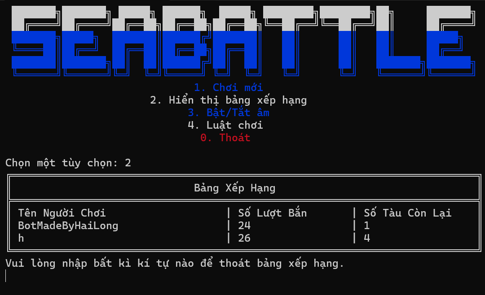
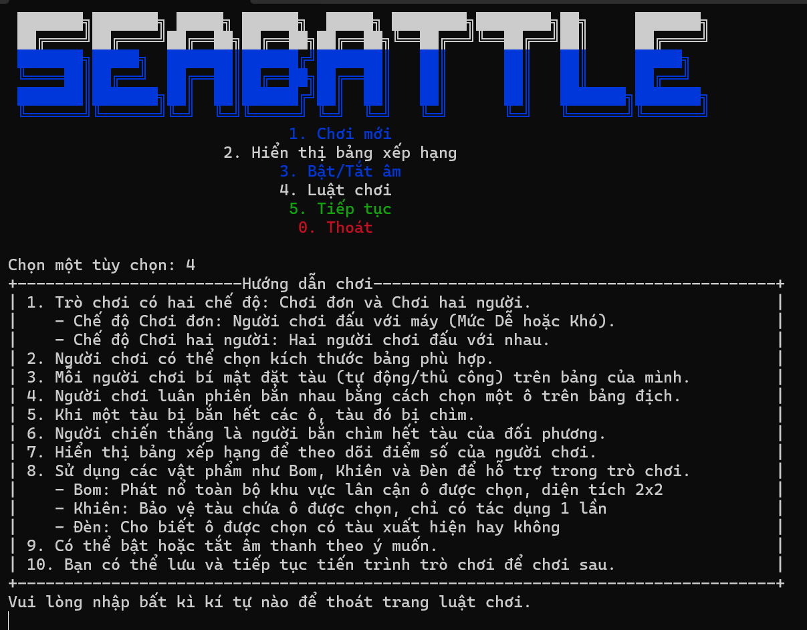
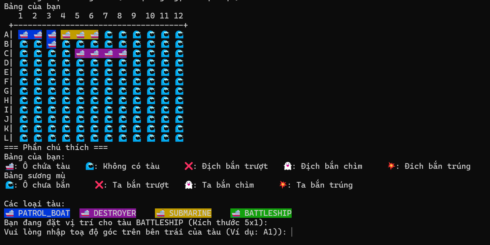
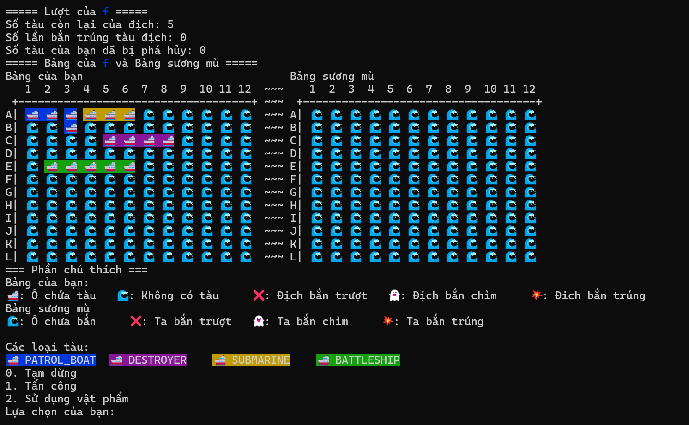
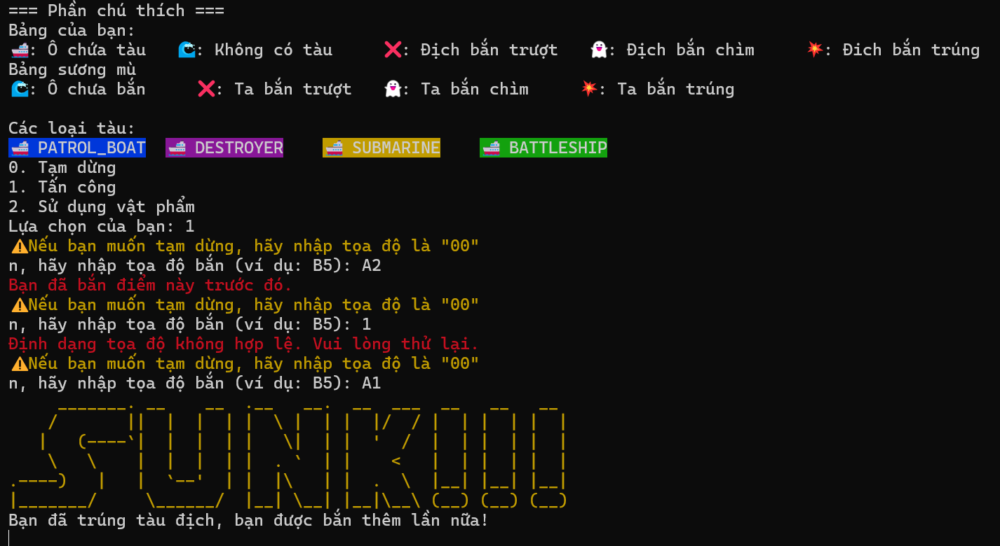

# Sea Battle

Sea Battle is a game for two players. The game is played on four grids, two for each player. The grids are typically square – usually 10×10 – and the individual squares in the grid are identified by letter and number. On one grid the player arranges ships and records the shots by the opponent. On the other grid the player records their own shots.

The project was done by [Trần Hải Long](https://github.com/team3hailong), in the course of Object Oriented Programming at [ProPTIT](https://proptit.com/).


## Tech Stack

- [Java](https://www.java.com/en/) 

## Software Design (UML)
### Class Diagram
- 
 
### Activity Diagram
- 

## Demo Video

[![[ProPTIT] OOP Course - SeaBattle](https://i.ytimg.com/an_webp/kl95eOPqVwc/mqdefault_6s.webp?du=3000&sqp=CNzsuLsG&rs=AOn4CLDu6OuV-kCNvxhgcTgt4ZCorxNdNQ)](https://www.youtube.com/watch?v=9R48sjtqH1M "[ProPTIT] OOP Course - SeaBattle")

## Demo Image







## Features
- Players can play against the computer (Hard or Easy Mode)
- Players can play against another player
- Players can choose the game mode (single-player - or multiplayer)
- Players can select the board size
- Display a leaderboard to track scores
- Use power-ups such as Bomb, Shield, and Light
- Option to enable or disable sound
- Save and continue game progress
- Display detailed game rules
- Turn-based interactive game mechanics
- Automatically or manually place ships

## Installation

- Clone the repo
- Open the project in your IDE
- Run the project

## Usage

- Project Structure

```bash

Product/
├── src/
│   ├── controller/
│   │   ├── Main.java
│   │   └── gamemanager/
│   │       ├── BoardController.java
│   │       ├── BotFunction.java
│   │       ├── GameFunction.java
│   │       ├── GameStateFunction.java
│   │       ├── ItemManager.java
│   │       ├── PlayerFunction.java
│   │       ├── shipplacement/
│   │       │   ├── ManualPlacementStrategy.java
│   │       │   ├── PlacementStrategy.java
│   │       │   ├── ShipPlacement.java
│   │       │   └── RandomPlacementStrategy.java
│   │       └── SoundController.java
│   ├── model/
│   │   ├── enums/
│   │   │   ├── FireResult.java
│   │   │   ├── GameStatus.java
│   │   │   ├── ShipType.java
│   │   │   ├── Orientation.java
│   │   │   └── CellStatus.java
│   │   ├── items/
│   │   │   ├── Bomb.java
│   │   │   ├── Light.java
│   │   │   ├── Shield.java
│   │   │   └── Item.java
│   │   └── game/
│   │       ├── Ship.java
│   │       ├── PlayerRecord.java
│   │       ├── Player.java
│   │       ├── GameState.java
│   │       ├── Board.java
│   │       ├── Leaderboard.java
│   │       ├── Sound.java
│   │       ├── Cell.java
│   │       └── Game.java
│   └── view/
│       ├── MenuInterface.java
│       └── EventInterface.java
├── resources/
│   ├── data/
│   │   ├── record.txt
│   │   ├── tempGame.txt
│   │   └── soundSettings.txt
│   └── sound/
│       └── *.wav
├── other/
│   ├── META-INF/
│   │   └── MANIFEST.MF
│   └── Product.iml


```

## Contributing

Pull requests are welcome. For major changes, please open an issue first
to discuss what you would like to change.

Please make sure to update tests as appropriate.

## License

[MIT](https://choosealicense.com/licenses/mit/)